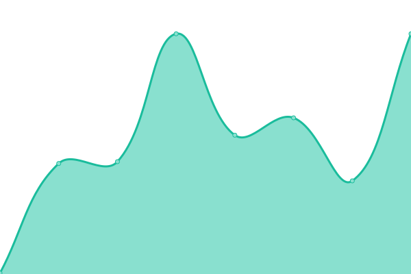
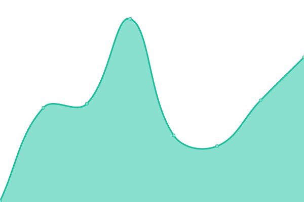

# [📈 Live Status](https://blog.ppodds.website/Uptime/): <!--live status--> **🟧 Partial outage**

This repository contains the open-source uptime monitor and status page for [Upptime](https://upptime.js.org), powered by [Upptime](https://github.com/upptime/upptime).

<!--start: status pages-->
<!-- This summary is generated by Upptime (https://github.com/upptime/upptime) -->
<!-- Do not edit this manually, your changes will be overwritten -->
<!-- prettier-ignore -->
| URL | Status | History | Response Time | Uptime |
| --- | ------ | ------- | ------------- | ------ |
|  [Personal Website](https://ppodds.website) | 🟥 Down | [personal-website.yml](https://github.com/ppodds/Uptime/commits/HEAD/history/personal-website.yml) | 

 799ms
     
 | 

<a href="https://ppodds.github.io/Uptime/history/personal-website">98.10%</a>
    

|  [Blog](https://blog.ppodds.website) | 🟥 Down | [blog.yml](https://github.com/ppodds/Uptime/commits/HEAD/history/blog.yml) | 

 159ms
     
 | 

<a href="https://ppodds.github.io/Uptime/history/blog">98.10%</a>
    

|  [MC Server](ppodds.website) | 🟩 Up | [mc-server.yml](https://github.com/ppodds/Uptime/commits/HEAD/history/mc-server.yml) | 

 234ms
     
 | 

<a href="https://ppodds.github.io/Uptime/history/mc-server">99.28%</a>
    

|  [NCU+](https://ncuplus.ppodds.website) | 🟥 Down | [ncu.yml](https://github.com/ppodds/Uptime/commits/HEAD/history/ncu.yml) | 

 648ms
     
 | 

<a href="https://ppodds.github.io/Uptime/history/ncu">98.30%</a>
    

<!--end: status pages-->

[**Visit our status website →**](https://blog.ppodds.website/Uptime/)

## 📄 License

- Powered by: [Upptime](https://github.com/upptime/upptime)
- Code: [MIT](./LICENSE) © [Upptime](https://upptime.js.org)
- Data in the `./history` directory: [Open Database License](https://opendatacommons.org/licenses/odbl/1-0/)
